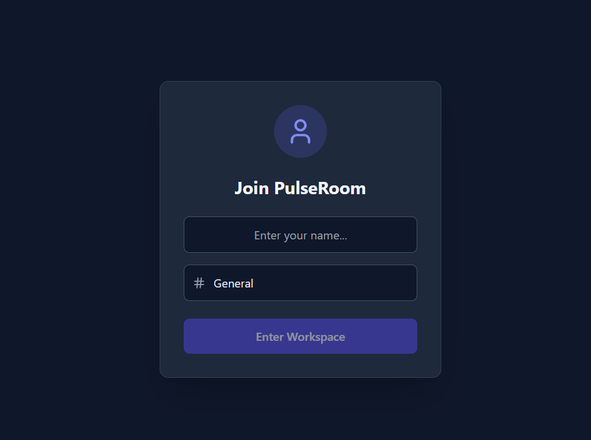

  
  # 💬 PulseRoom
  **Real-Time Workspace Chat Application**
  
  
  
  
  

_A modern, segregated chat environment built for seamless communication._

[Live Frontend Demo](https://pulse-room-one.vercel.app) • [Backend API](https://pulseroom-z7gh.onrender.com) • [Report Bug](https://github.com/Shivam-hub976/PulseRoom/issues)

**Github** : *https://github.com/Shivam-hub976/PulseRoom*

---

## Overview

PulseRoom is a full-stack real-time messaging application designed with a sleek, dark-themed UI. It moves beyond standard global chat by implementing **isolated communication channels (Rooms)**, ensuring conversations remain context-specific and secure.

## Key Features

- **Channel Segregation (Rooms):** Users can join specific workspaces (e.g., _General, Tech Support, Off-Topic_). Messages and events are strictly isolated to the active room.
- **Real-Time Bidirectional Communication:** Instant message delivery powered by WebSockets, bypassing traditional HTTP polling limits.
- **Smart Typing Indicators:** Real-time feedback when other users are typing, featuring an automatic 1.5-second debounce timeout to clear the indicator.
- **Smooth Auto-Scroll:** Intelligent chat window management that seamlessly anchors the view to the latest incoming messages.
- **Modern UI/UX:** Built with Tailwind CSS and Lucide React icons, offering a responsive, accessible, and polished dark-mode aesthetic.

## Architecture & Event Flow

PulseRoom relies on event-driven architecture using Socket.io. Key socket events include:

- `join_room`: Subscribes the client to a specific Socket.io room.
- `send_message`: Broadcasts the payload strictly to `socket.to(room)`.
- `typing` / `stop_typing`: Emits state changes to the specific room to manage UI indicators.

## Tech Stack

### Client-Side (Frontend)

- **Framework:** React.js (Vite)
- **Styling:** Tailwind CSS
- **WebSocket Client:** `socket.io-client`
- **Icons:** `lucide-react`
- **Deployment:** Vercel

### Server-Side (Backend)

- **Runtime:** Node.js
- **Framework:** Express.js
- **WebSocket Server:** `socket.io`
- **Deployment:** Render

---

### Future Scope

- **Authentication**: _Implement JWT-based secure user login._
- **Database Integration**: _Connect MongoDB to persist chat history across sessions._
- **Media Sharing**: _Enable image and file attachments within chat rooms._
- **& Many more**: ...

---

_Developed by Shivam Kumar_
